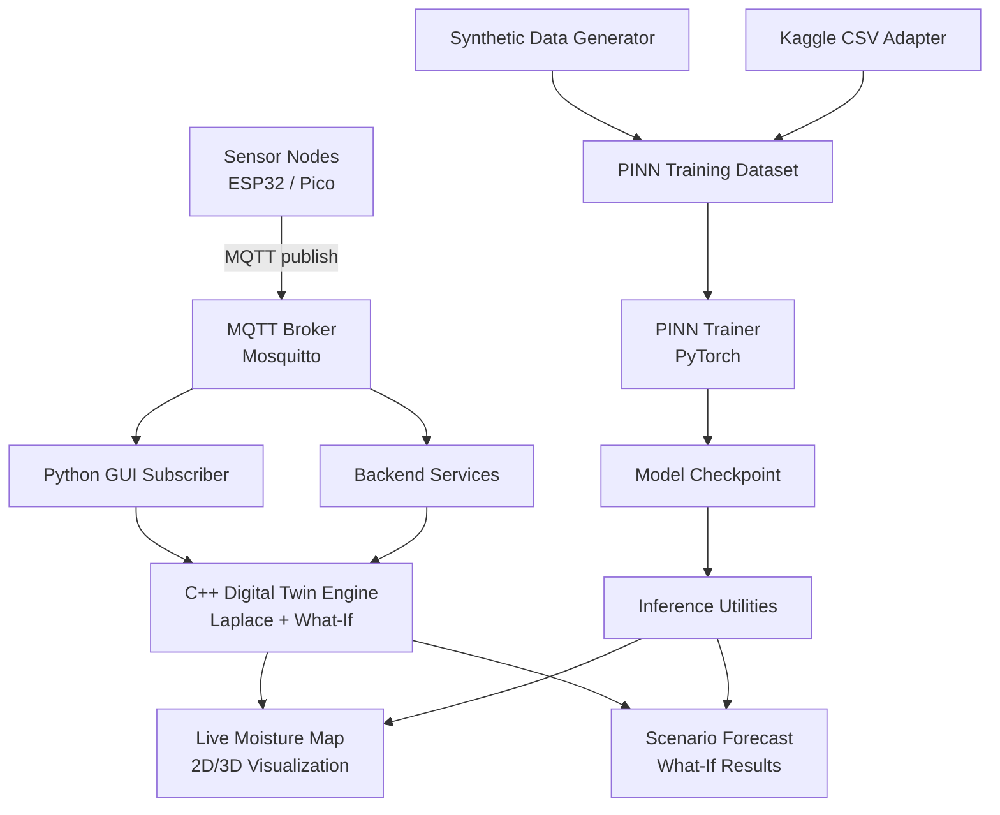
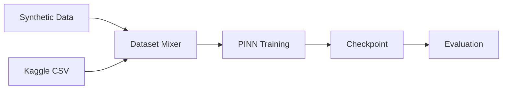

# Greenhouse Digital Twin Workflow

## End-to-End Workflow (Mermaid)

## Training Workflow (Hybrid)

## Operational Loop

1. Collect live sensor telemetry via MQTT.
2. Update dashboard and digital twin map.
3. Run what-if simulation for trend exploration.
4. Periodically retrain PINN with synthetic + Kaggle mix.
5. Deploy updated checkpoint for improved predictions.
